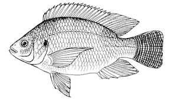

# Alometry law for the Nile Tilapia



(image from [Fishsource](https://www.fishsource.org/aqua_page/17))

We use the alometry law $y = A x^B$ to correlate the length $x$ of the fish tilapia with its mass $y$. The following table for the length-weight relationship of growing-finishing cage-farmed Nile tilapia *(Oreocromis niloticus)*is provided in the article [T. S. de Castro Silva, L. D. dos Santos, L. C. R. da Silva, M. Michelato, V. R. B. Furuya, W. M. Furuya, Length-weight relationship and prediction equations of body composition for growing-finishing cage-farmed Nile tilapia, R. Bras. Zootec. vol.44 no.4 Viçosa Apr. 2015)](https://www.scielo.br/scielo.php?script=sci_arttext&pid=S1516-35982015000400133):


| Days of culture | 1 | 20 | 40 | 60 | 80 | 100 |
| --- | --- | --- | --- | --- | --- | --- |
| Mass (g) | 28.6 ± 4.2 | 88.6 ± 1.4 | 177.6 ± 3.6 | 313.8 ± 12.8 | 423.7 ± 12.7 | 774.4 ± 23.6 |
| Length (cm) | 10.9±0.4 | 15.3±0.4 | 19.1±0.2 | 22.8±0.5 | 26.3±0.6 | 31.3±0.4 |

We use [Turing.jl](https://turing.ml/) with the compound model

```math
    \begin{align*}
        A & \sim \mathrm{InverseGamma}(\alpha_A, \beta_A) \\
        B & \sim \mathrm{InverseGamma}(\alpha_B, \beta_B) \\
        \sigma^2 & \sim \mathrm{InverseGamma}(2, 1) \\
        y & \sim \mathrm{Normal}(A x^B, \sigma^2)
    \end{align*}
```

with suitable hyperparameters $(\alpha_A, \beta_A)$ and $(\alpha_B, \beta_B)$ to be chosen shortly.

We start by loading the necessary packages:

```@example tilapia
using Distributions, Turing, StatsPlots
```

Then we collect the adimensionalized data in vector form and plot it for the fun of it:

```@example tilapia
xx = [10.9, 15.3, 19.1, 22.8, 26.3, 31.3]
yy = [28.6, 88.6, 177.6, 313.8, 423.7, 774.4]

scatter(xx, yy, xlabel="Body length (cm)", ylabel="Body weight (g)", xlims=(0.0, 35.0), ylims=(0.0, 1000.0), title="Length-weight relationship of growing-finishing cage-farmed Nile tilapia", titlefont=10, legend=nothing)
```

We define the Turing.jl model with parameters $A$ and $B$ as Inverse Gamma functions with hyperparameters `Ah = (Ah.α, Ah.β)` and `Bh=(Bh.α, Bh.β)`.

```@example tilapia
@model function alometry(x, q; Ah, Bh)
    A ~ InverseGamma(Ah.α, Ah.β)
    B ~ InverseGamma(Bh.α, Bh.β)
    σ² ~ InverseGamma(2, 1)
    σ = sqrt(σ²)

    for i in eachindex(x)
        y = A * x[i] ^ B
        q[i] ~ Normal(y, σ)
    end
end
```

As in any nonlinear optimization problem, the starting point is crucial. Here, the starting point is our prior. The following prior does not work properly, as we can see.

```@example tilapia
model = alometry(xx, yy; Ah=(α=1,β=1), Bh=(α=1,β=1))
chain = sample(model, NUTS(0.65), 1_000)
```

```@example tilapia
plt = scatter(xx, yy, xlabel="Body length (cm)", ylabel="Body weight (g)", xlims=(0.0, 35.0), ylims=(0.0, 1000.0), title="Length-weight relationship of growing-finishing cage-farmed Nile tilapia", titlefont=10, legend=nothing)
xxx = range(first(xx), last(xx), length=200)
yyy = mean(chain, :A) * xxx .^ mean(chain, :B)
plot!(plt, xxx, yyy)
```

If we start with a more informative prior, we get a suitable result. If we pick two data points $(x_1, y_1)$ and $(x_2, y_2)$, assuming $y \approx Ax^B$, we have $y_2/y_1 = (x_2/x_1)^B$, so that

```math
    B = \frac{\ln(y_2/y_1)}{\ln(x_2/x_1)}.
```

If we choose the second and third points, we get

```@example tilapia
    B = log(yy[3]/yy[2])/log(xx[3]/xx[2])
```

From that, we can also estimate $A$ from $A = y/x^B$, so that, choosing the second point

```@example tilapia
    A = yy[2]/xx[2]^B
```

With that in mind, we choose the hyperparameters for the prior as $(\alpha_A, \beta_A) = (57, 1)$, with mean $1/(57+1) \approx 0.017$, and $(\alpha_B, \beta_B) = (1, 6)$, with mean $6/(1+1) = 3.0$.

```@example tilapia
model = alometry(xx, yy; Ah=(α=57,β=1), Bh=(α=1,β=6))
```

With this prior, we attempt again to fit the model.

```@example tilapia
# chain = sample(model, HMC(0.05, 10), 4_000) # HMC seems quite unstable here
chain = sample(model, NUTS(0.65), MCMCSerial(), 1000, 3; progress=false)
```

Here is the result of the chain.

```@example tilapia
plot(chain)
```

Taking the mean of the parameters $A$ and $B$ we plot the fitted curve.

```@example tilapia
plt = scatter(xx, yy, xlabel="Body length (cm)", ylabel="Body weight (g)", xlims=(0.0, 35.0), ylims=(0.0, 1000.0), title="Length-weight relationship of growing-finishing cage-farmed Nile tilapia", titlefont=10, legend=nothing)
xxx = range(first(xx), last(xx), length=200)
yyy = mean(chain, :A) * xxx .^ mean(chain, :B)
plot!(plt, xxx, yyy)
```

This seems successful. Now we compute the 95% credible interval

```@example tilapia
quantiles = reduce(
    hcat,
    quantile(
        [
            A * x^B for (A, B) in eachrow(view(chain.value.data, :, 1:2, 1))
        ],
        [0.05, 0.95]
        )
    for x in xxx
)
```

and plot it along the data:

```@example tilapia
plt = plot(xlabel="Body length (cm)", ylabel="Body weight (g)", xlims=(0.0, 35.0), ylims=(0.0, 1000.0), title="Length-weight relationship of growing-finishing cage-farmed Nile tilapia", titlefont=10, legend=nothing)
plot!(plt, xxx, yyy, ribbon=(view(quantiles, 1, :) .- yyy, yyy .- view(quantiles, 2, :)), label="Bayesian fitted line", color=2)
scatter!(plt, xx, yy, color=1)
```
